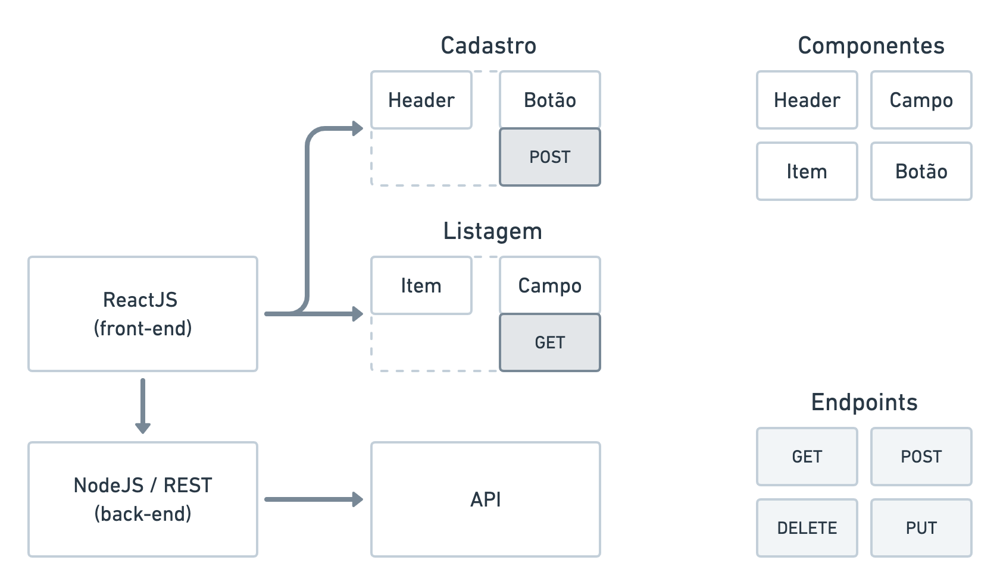

<h1 align="center">Cypress MultiLevel Testing</h1> 

<p align="center"><strong>O que é Cypress?</strong></p>
<p align="center">Cypress é uma ferramenta para testes de aplicações em múltiplos níveis. Veja isso na prática</p>

<h2 align="center"><a href="https://linktr.ee/agilizei">Acompanhe o Agilizei ⚡️ </a></h2>

# Aplicação 

Neste projeto, estamos utilizando a aplicação *Proffy* desenvolvida da NLW #02 da RocketSeat.

# Arquitetura

<p align="center"></p>

# Níveis de testes

## Componente
Podemos executar testes de componentes utilizando o Cypress. Neste projeto, usamos:

- cypress-react-unit-test

Exemplo:
```js
  it('deve ser renderizado com sucesso', () => {
    mount(
      <Router>
        <PageHeader 
          title="TDC2020"
          description="Trocando uma ideia sobre Cypress de ponta a ponta"
        />
      </Router>
    )

    cy.get('strong').should('have.text', 'TDC2020');
```

## API
Podemos executar testes de APIs utilizando o Cypress. Neste projeto, usamos:

- cy-api (apenas para melhorar a visibilidade do que está sendo enviado/recebido)

Exemplo:
```js
  it('GET deve retornar status 200', () => {

    cy.api({
      method: 'GET',
      url: `${Cypress.env('API_URL')}/connections`
    }).then((connectionsResponse) => {
      expect(connectionsResponse.status).to.eq(200)
    })
  });
```


## UI
Podemos executar testes de UI utilizando o Cypress.

Exemplo:
```js
  it('Acessar a página inicial com conexões realizadas', () => {
    cy.visit('/');

    cy.get('span.total-connections').should('contain.text', '5');
  });
```

